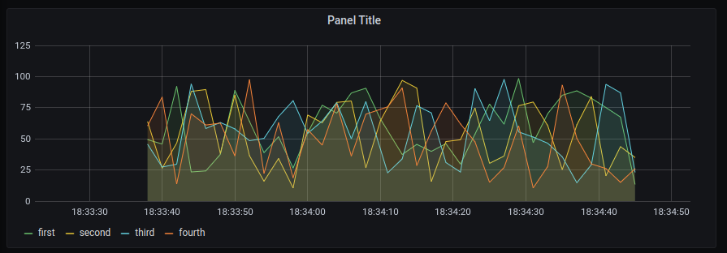

# Internship-task
My OZON internship task

## Definition
1. Написать python-сервис (ожидаемая нагрузка до 10 RPS), который:
    * принимает на вход  POST запросы вида  {“metric_name”: <str>, “metric_value”: <float>}. На запрос неправильного формата нужно отдавать соответствующий HTTP статус, правильного -- {“message”: “ok”} 
    * складывает результаты в табличку в Clickhouse
2. Поднять Grafana на 3000 порту, в которой сделать простой дэшборд на свое усмотрение, выводящий график этих метрик (с красотой заморачиваться не нужно -- необходима самая простая демонстрация работы)
Clickhouse, Grafana и сам сервис должны быть подняты с помощью docker-compose. Решение должно быть воспроизводимо на машине проверяющего.

## Solution
Первоначально, с помощью docker-compose были подняты:   
   * Grafana на порте 3000
    
   * Clickhouse на портах 8123 и 9000
 
В файле [docker-compose.yml](docker-compose.yml) прописаны все зависимости и параметры запуска grafana, clickhouse и web, с встроенной сеткой (network) для их взаимодействия друг с другом.

Для генерации таблицы и базы данных в clickhouse был написан скрипт [bd_create.sh](web/bd_create.sh), который запускается после билда clickhouse при запуске web.

Затем был написан небольшой python-сервис [app.py](web/app.py) на Flask (порты 0.0.0.0:9880 : 0.0.0.0:80), принимающий на вход POST запрос. Этот сервис обрабатывает запрос, проверяя корректность json-а, складывает данные в табличку click.clickhouse (click - database) с текущей TimeStamp и возвращает соответсвующий ответ. (OK или BAD REQUEST)

Для проверки корректности ответов сервиса был написан небольшой скрипт [query.sh](query.sh), который посылает 2 запроса, с ожидаемыми ответами: "OK" и "BAD REQUEST".

Для построения dashboard-а внутри grafana был подключен плагин clickhouse, для того, чтобы grafana могла сама брать данные из таблички и отображать их в dashboard-е. Для этого нужно было добавить Data Source с clickhouse и установить url на clickhouse:8123, затем перейти к dashboard-ам и создать новый, прописав запросы.

Для просмотра результата и проверки нагрузки был написан дополнительный генератор [loop.py](loop.py), который каждые 5 секунд посылает 10 запросов к сервису (metric_value генерируются случайным образом).

Внутри grafana были написаны простые запросы для вывода графиков, где по оси OX - TimeStamp, а OY - metric_value. В качестве примера было построено 4 графика для первых 4-х метрик.

(Example)
```SQL
SELECT
    $timeSeries as t,
    metric_value as first
FROM $table

WHERE $timeFilter AND metric_name = 'metric_1'
```


